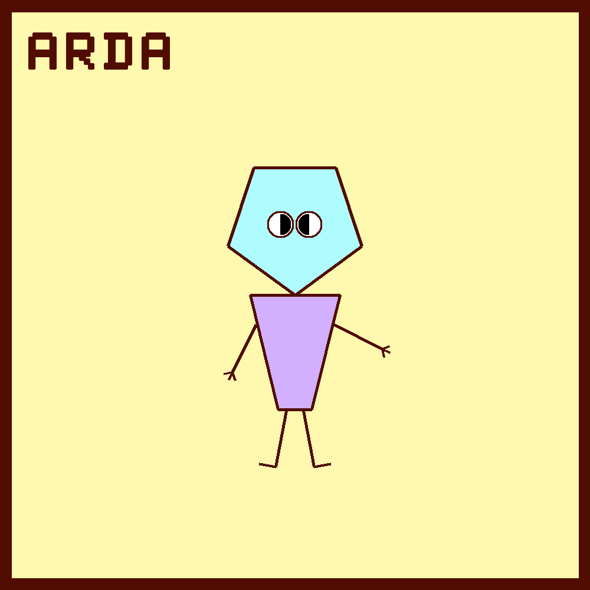
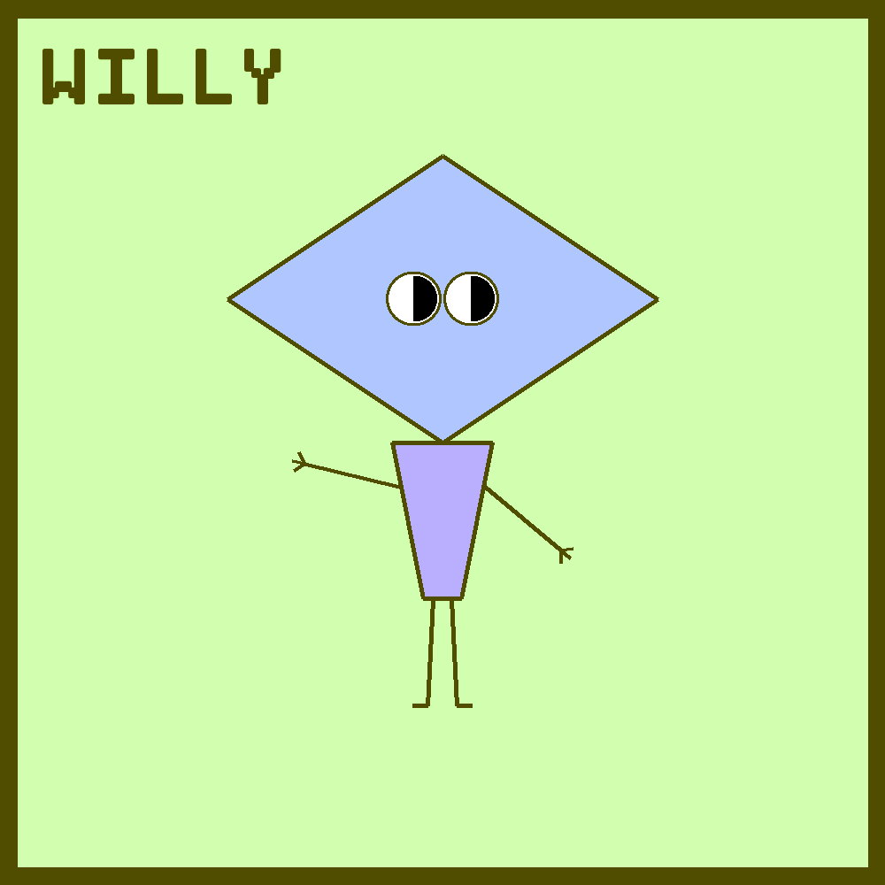
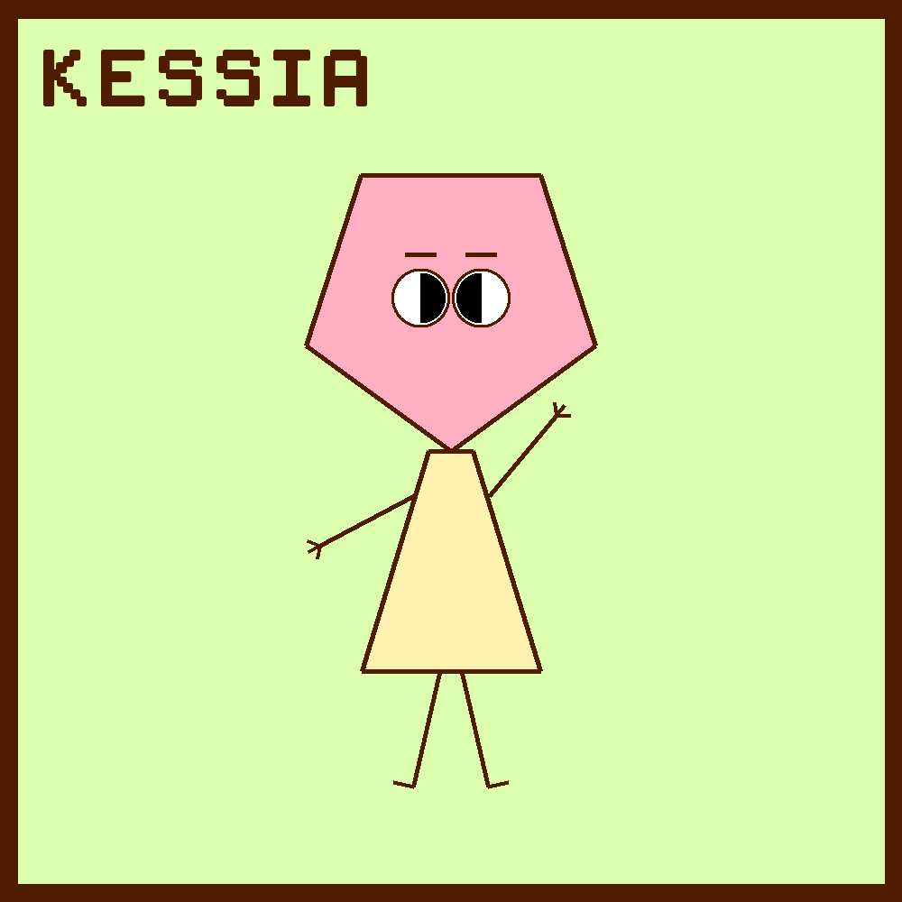
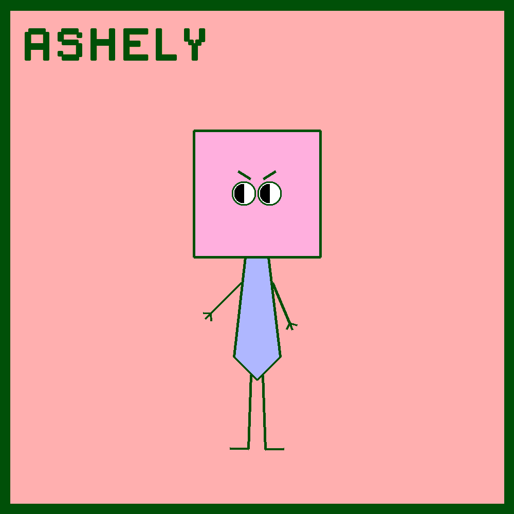

# PolyFriends Bot
[PolyFriends](https://twitter.com/PolyFriendsBot) is a Twitter bot that tweets randomly generated polygon characters. Each character is given a name and a hobby!

## Generation
The characters are generated from pre-defined body & head shapes. The size of the head and length of the body however are random. The arms and legs also have random lengths.

## Example Images

