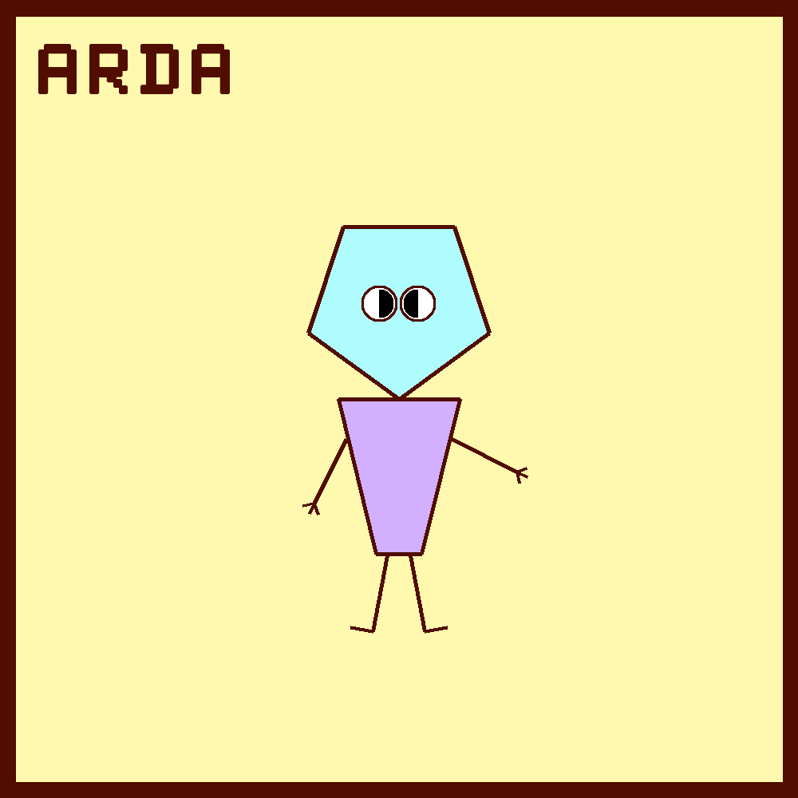
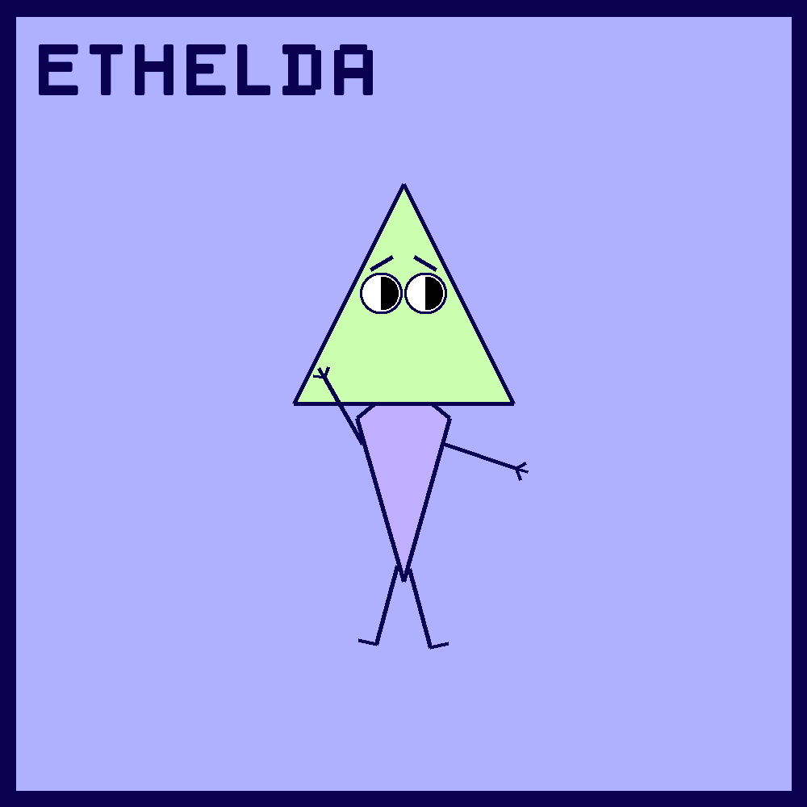
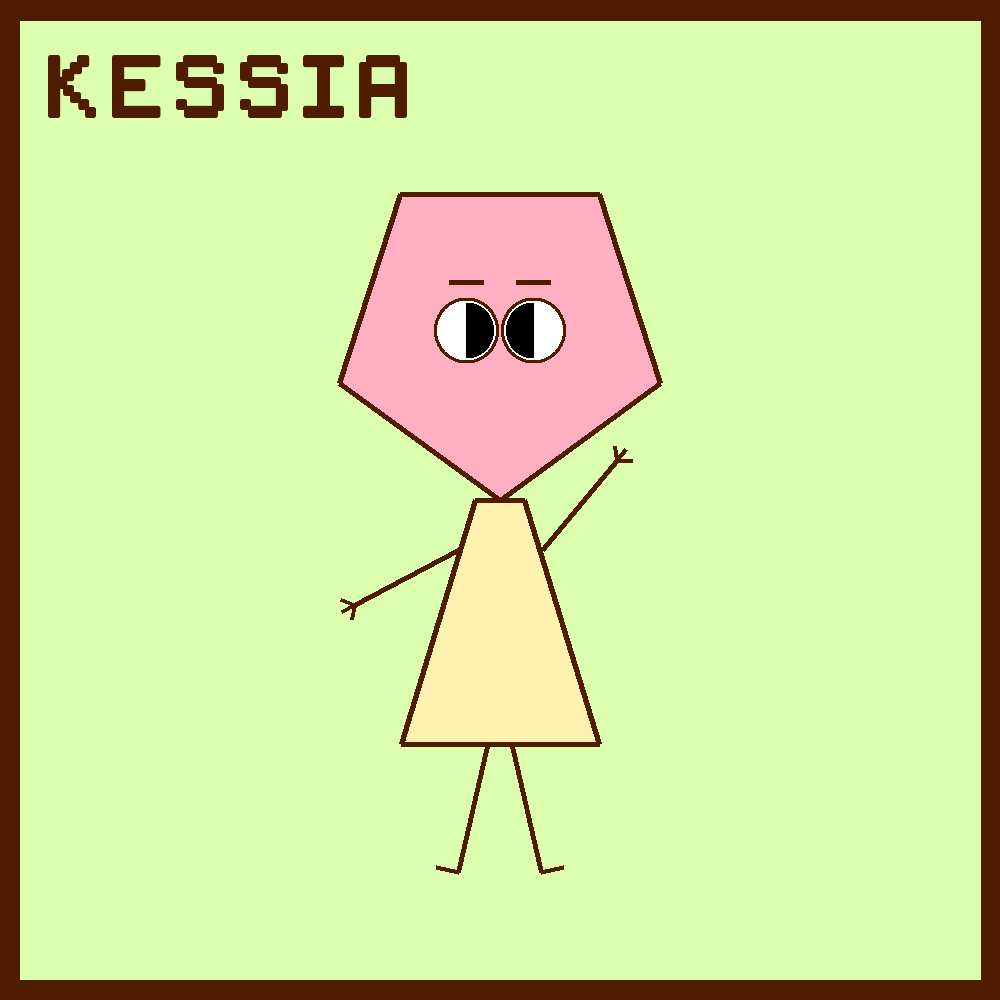

# PolyFriends Bot
[PolyFriends](https://twitter.com/PolyFriendsBot) is a Twitter bot that tweets simple randomly generated polygon characters. Each character is given a unique name, hobby, and favorite color!

## Generation
The characters are generated from pre-defined body & head shapes, however the size of the head and length of the body are randomized. The arm angles & lengths, leg angles & lengths, eye position, eye shape, eyebrows, and fill colors are also random as well.

## Running
Usage: `python3 bot.py [--tweet] [--date_stamp]`
* `--tweet` : Tweets the created image (Only if keys and access tokens are located in `keys.txt`)
* `--date_stamp` : Saves the image with a unique date & time stamp for the file name.

## Example Images

    
    
    

